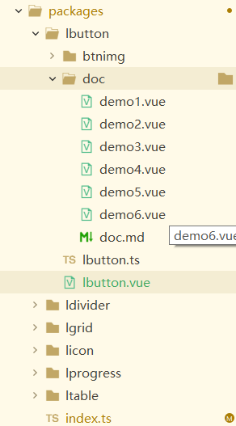
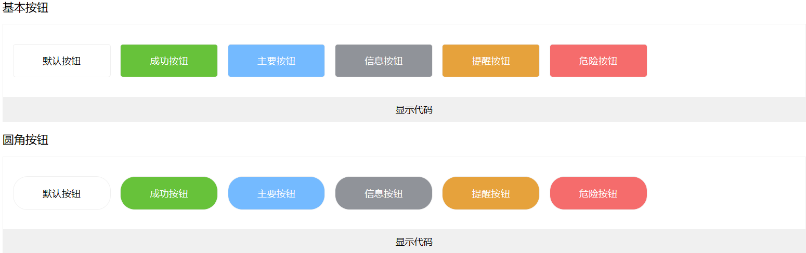

# 组件库的创建

## 目录结构
我们首先在根目录下创建一个packages文件夹，这个文件夹将存放所有的组件的封装，全局注册方法，以及组件的引用演示。
目录结构如下

lbutton是组件的文件夹名字，在lbutton有几个文件,lbutton.vue是用来封装组件的具体文件，doc文件是用来存放封装好的组件的引用和演示。dome1.vue-demo6.vue是引用分装好点的组件,引用好之后就在doc.md集体演示。index.ts用来对封装好的组件进行全局注册。我们从全局注册开始看起

## 组件全局注册

首先我们在lbutton.vue中的script中定义好组件的名称，代码如下：
```
export default{
    name:"l-butotn"
}
```
声明好名字后，在packages/index.ts中给组件注册全局,index.ts使我们自己创建的哦
```
import lbutton from './lbutton/lbutton.vue';//引入lbutton.vue文件

const allcom=[
	lbutton
] //定义数组接收导入的组件

const recom =function(app:App){
	for(const allco of allcom){
		app.component(allco.name,allco)
	}
}; //组件的全局注册写法
export {lbutton};
export default recom; //最后将这些都导出
```
接下来是全局注册的最后一步,在main.ts中去使用他，完成组件的全局注册
```
import alloc from '../packages/index';//引入刚才的index.ts
const app=createApp(App);
app.use(alloc);//使用use方法去调用他
app.mount('#app');
```
这一步完成之后我们的组件就可以在全局直接引用了。像这样.
```
<l-button >默认按钮</l-button> //l-button是我们在一开始的lbutton.vue中导出的名字
```
## 组件封装
展示部分代码
```
<template>
	<div class="btncon">
		<button :class="lclass"><slot><span></span></slot></button>
	</div>
</template>
```
在template中solt是插槽，在组件中经常要用到它，用法课参考vue官网:https://cn.vuejs.org/guide/components/slots.html#slots
```
<script setup lang="ts">
	import {computed,ref} from 'vue';
	const props=defineProps({
		type:{
			type:String,
			default:"default"
		},
		round:Boolean,
		tsy:{
			type:Boolean,
			default:false
		},
		icon:{
			type:Boolean,
			default:false
		},
		sizes:{
			type:String,
			default:""
		},
		dis:{
			type:Boolean,
			default:false
		}
	});
	const lclass=computed(()=>{
		return [
			"lbutton",`lbutton-${props.type}`,
			props.round?"lbutton-round":"",
			props.tsy?`lbutton-tsy`:"",
			props.icon?"lbutton-icon":"",
			`lbutton-sizes-${props.sizes}`,
			props.dis?"dis":""
		]
	});


</script>
```
```
<style lang="scss" scoped>
	button{
		outline: none;
		border: 0;
		background: none;
		cursor: pointer;
	}
	.lbutton{
		padding: 2vh 3vw;
		margin: 0;
		border-radius: 4px;
		border: 1px solid #f0f0f0;
		margin-left: 1vw;
		&:hover,&:focus{
			opacity: .8;
		}
	}
	.lbutton-success{
		color: white;
		background:$success;
		background-color:$success;
		&.lbutton-tsy{
			border: 1px dashed $info;
			background-color: white;
			color: $success;
			&:hover{
				background-color: $success;
				color: white;
				opacity: .8;
			}
		};
		&.lbutton-icon{
			width: 3vw;
			height: 3vw;
			padding: 0;
			border-radius:50%;
			background-image: url(./btnimg/btnicon2.png);
			background-size: 1vw;
			background-repeat: no-repeat;
			background-position:center;
		};
		&.lbutton-sizes-small{padding: 0;width: 5vw;height: 4vh;};
		&.lbutton-sizes-big{width: 12vw;height: 10vh;};
		&.dis{cursor: not-allowed;opacity: .5;}
	}
```
这是一部分代码。我们直接看组件演示。

## 组件的引用和演示。
我们在demo1.vue-demo6.vue中分别去引用不同功能的组件用法。
比如在demo1.vue中引用组件的基本用法。
```
<template>
	<l-button type="default">默认按钮</l-button>//基本用法不同颜色的按钮
	<l-button type="success">成功按钮</l-button>
	<l-button type="primary">主要按钮</l-button>
	<l-button type="info">信息按钮</l-button>
	<l-button type="warning">提醒按钮</l-button>
	<l-button type="danger">危险按钮</l-button>
</template>
```
在demo2.vue中引入圆角按钮的用法
```
<template>
	<l-button type="default" round>默认按钮</l-button> round属性对应圆角按钮
	<l-button type="success" round>成功按钮</l-button>
	<l-button type="primary" round>主要按钮</l-button>
	<l-button type="info" round>信息按钮</l-button>
	<l-button type="warning" round>提醒按钮</l-button>
	<l-button type="danger" round>危险按钮</l-button>
</template>
```

然后我们在doc.md中一起引入他们展示在页面上看效果，首先是引入
```
import demo1 from './demo1.vue';
import demo2 from './demo1.vue';
<demo1></demo1>
<demo2></demo2>
```
然后我们看最终效果,
这样我们就完成了一个简单的button组件的封装了。

## 用到的插件 vite-plugin-md
一个可以将md文件渲染成vue文件的插件，这个组件库的搭建中，我们用用它来集中演示组件，以及一些页面的渲染。